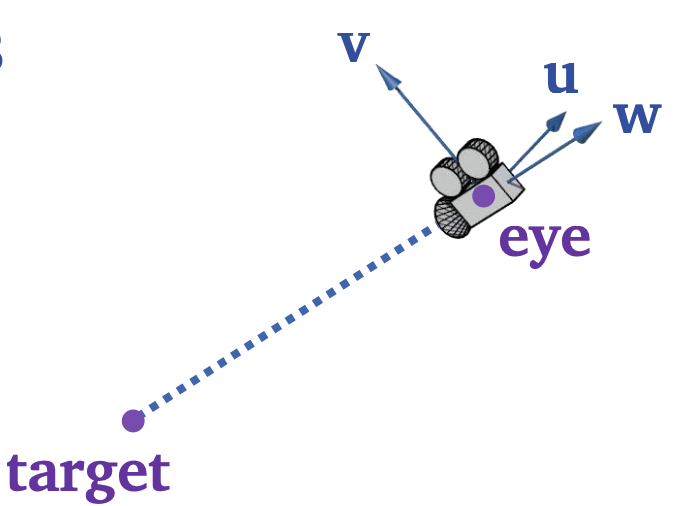
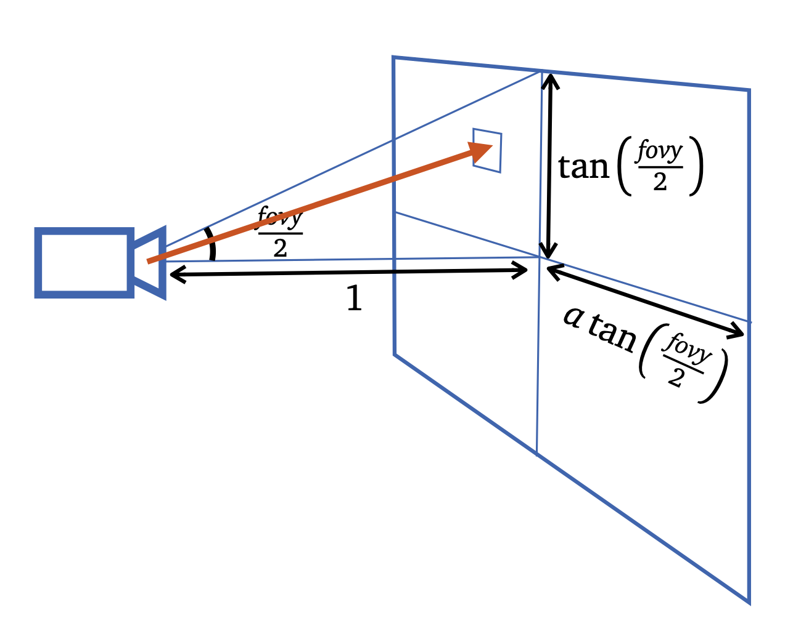
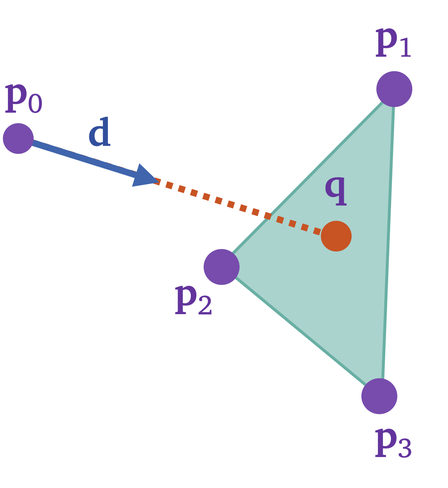
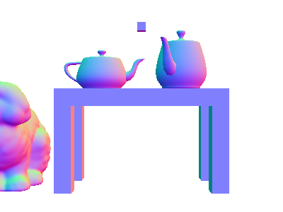
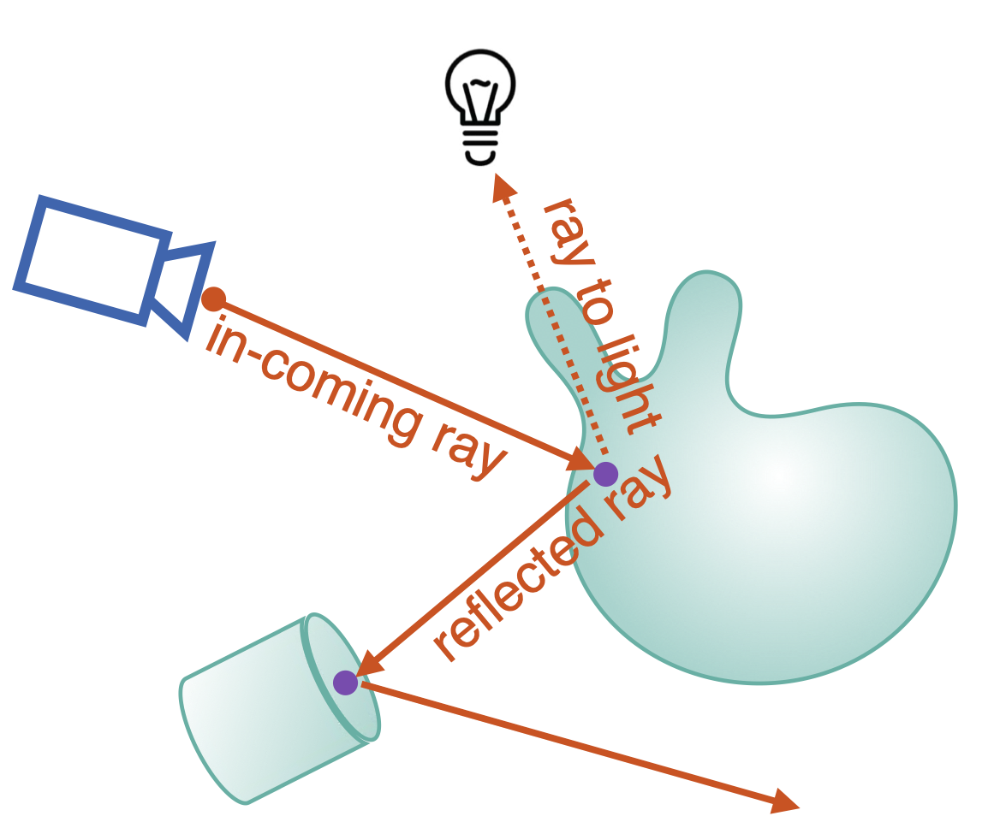
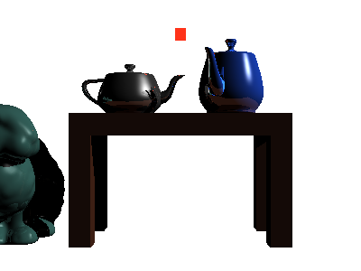
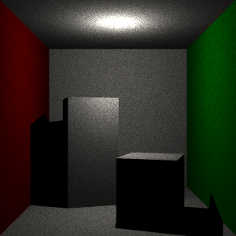
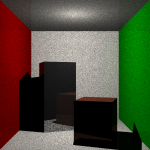
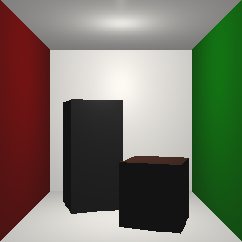

# Project 4: Ray Tracer

## Introduction

Ray Tracing is one of the most powerful techniques in Computer Graphics to generate photorealistic renderings. Some of the main shortcomings, that we even experienced when creating rasterized graphics were the absence of soft shadows, mirror and glossy reflections, inter-reflections and transparency. All these problems can be solved by various ray tracing solutions and I hope to demonstrate a couple of these in my project as well.

At its core, ray traycing works by shooting light rays from a point onto the screen image and calculating the color based on the geometry that it hits. Using this principle, we are able to recursively model the path that the light rays travel and simulate visuals that accurately model the way light and images work in the real world.

## Implementation

To begin with, we want to be able to display images. Since I am using the openGL pipeline to create a rasterized version of the image for comparisons, we can make use of the texture buffer and load our image pixels into it. This way, we can simulate a "screen" and load the texture into the frame buffer to finally display the image. If we add random colors to the pixel array, we finally are able to get our first rendered image.

<figure>
  

  
  <figcaption>Random Pixel Render</figcaption>
    

</figure>

### Ray Casting

Now that we have a way of displaying images to our screen, we want to set the right color for each pixel on our image. For each pixel, we will shoot a ray from our camera point onto the center of the pixel. For this ray, we would need its position of origin, and the direction. The ray's position $p_0$ would be that of the camera but to get the direction of the ray through the center of the pixel, we would need to calculate the camera's $\textbf{u}$, $\textbf{v}$ and $\textbf{w}$ vectors

<figure>
  

  
    

</figure>

$$
\textbf{w} = \frac{eye-target}{|eye - target|} \\
\textbf{u} = \frac{\textbf{up} \times \textbf{w}}{\textbf{up} \times \textbf{w}} \\
\textbf{v} = \textbf{w} \times \textbf{u}
$$

Once we have the vectors that make up the Camera matrix, we can calculate the center of the pixel along the normalized device coordinate space as follows

$$
\alpha = 2 \cdot \frac{i + 0.5}{width} - 1\\
\beta = 1 - 2\cdot \frac{j + 0.5}{height}\\

\text{ray direction }\textbf{d} = normalize(\alpha \cdot a\cdot\tan(\frac{fovy}{2})\textbf{u}+\beta\cdot\tan{(\frac{fovy}{2})}\textbf{v} - \textbf{w} )
$$

### Intersection

Now that we have the ability to create and cast rays from our camera to the screen, we want to be able to check if the ray hits any part of the geometry in the scene. To do this, one naiive approach (optimizations will be talked about later) would be to loop through all the triangles in the scene and check if the ray intersects with the triangle. To enable us to do this, we would use a `<vector>` data structure to create a list of triangles `triangle_soup` in the scene by using a depth first search algorithm to traverse the scene graph and populate `triangle_soup` while transforming the positions and normals to the common world coordinate system using the appropriate view matrices.

Once we have our populated `triangle_soup`, we can now iterate through each pixel in our image, cast a ray, and iterate through `triangel_soup` to check if the ray intersects with any of the triangles. To check for an intersection, we can compute the barycentric coordinate of the intersection point $\textbf{q}$ between the ray $(\textbf{p}_0, \textbf{d})$ and the current triangle.

We can thus solve the folowing system of equations to compute the barycentric point $\textbf{q}$
$$
\begin{bmatrix}
    \vert & \vert & \vert & \vert \\
    \textbf{p}_1 & \textbf{p}_2 & \textbf{p}_3 & -\textbf{d}   \\
    \vert & \vert & \vert & \vert \\
    1 & 1 & 1 & 0
\end{bmatrix}
\begin{bmatrix}
    \lambda_1 \\
    \lambda_2 \\
    \lambda_3 \\
    t \\
\end{bmatrix}

= \begin{bmatrix}
    \vert \\
    \textbf{p}_0 \\
    \vert \\
    1 \\
\end{bmatrix}
$$

$$
\textbf{q} = \lambda_1\textbf{p}_1 + \lambda_2\textbf{p}_2 + \lambda_3\textbf{p}_3
$$

If $\lambda_1, \lambda_2, \lambda_3,t \ge 0$, we have an intersection with distance between $\textbf{p}_0$ and $\textbf{q}$ being $t$.

There will be cases where there would be different geometry in front of each other, resulting in multiple intersections per ray. In that case, we can take the closes intersection as we don't need to worry about the geometry behind since it would be covered anyways and we don't need to display its color. Once we get the intersections, we can color the pixels based on the normal of the geometry and get a silhouette of the scene

### Image Shading

We now have all the tools we need to compute colors based on the Blinn-Phong shading equation
$$
Color = \textbf{C}_\text{emission} + \sum_{i = 1}^{lights}(\textbf{C}_\text{ambient} + \textbf{C}_\text{diffuse}\max(\textbf n \cdot l_i, 0)+ \textbf{C}_\text{specular}\max(\textbf n \cdot h_i, 0)^\sigma)\ \textbf{L}_j
$$
where $\sigma \in \R$ is the shininess coefficient, and $\textbf{C}_\text{emission},\ \textbf{C}_\text{ambient},\  \textbf{C}_\text{diffuse},\ \textbf{C}_\text{specular}$ are the emission, ambient, diffuse and specular coefficients of the material. The vector $\textbf{n}$ is the surface normal, $l_i$ is the direction to the light and  is the half-way direction between the direction to the viewer and the direction to the light.

<figure>
  

  
  <figcaption>Blinn-Phong shading</figcaption>
    

</figure>

While we are able to color the pixels according to the geometry in the scene, we are not really utilizing the capabilities of raytracing to the maximum as this shading equation was made for rasterized images. As such it contains coefficients like $\textbf{C}_\text{ambient}$ that are derived to approximate ambient lighting using global illumination techniques. Instead of relying on these generalized approximations, we can add recursive ray-traced reflections and shadows to our image. 

<figure>
  

  
  <figcaption>Recursive reflections and shadows</figcaption>
    

</figure>

The general idea is that once we have an intersection between the ray and the geometry, we can do two things: shoot a ray `shadow_ray` straight at the light, and shoot a ray `reflected_ray` that is reflected according to the angle of incidence. If the shadow ray intersects with some geometry before reaching the light, the resulting color of the light would be $(0,0,0)$ black (shadow). If the reflected ray hits another geometry, we can recursively add its color to get a reflection. This recursive process allows us to get semi-realistic shadows and reflections in our image. Using a recrusive depth of $6$, we get the following image on the right.

<figure align="center" display="inline">
    
     
</figure>
As we can see, now we have a more realistic shading, with areas further away from the light appearing darker and in shadow. Taking a look at the teapot on the left you can even see a warped reflection of the turquoise bunny to its left and the shadow of the blue teapot's spout covering the specular reflection. The side of the legs of the table exposed to the light are darker than the parts away from it while the entire table casts a shadow on the onlooking bunny.

## Encore

### Optimizations

The entire scene had about 33576 triangles and iterating through each triangle 120000 times for each pixel results in really slow processing, especially since the program is currently only single threaded. To increase efficiency, in the rendering function I create 8 threads, and added each pixel to be rendered as a task in a task queue. Using signal variables and mutex locks, the threads can be woken up, assigned a pixel from the queue to be rendered, and do the ray tracing computations simultaneously, which exponentially sped up the computation time.

I am also in the process of implementing bounding volume hierarchies (BVH trees) using axis aligned bounding boxes (AABBs) inorder to drastically reduce the search space for the triangles in the geometry and only look for interesections when the ray is headed in the triangle's general direction. As this is the bottleneck for speed at the moment, I anticipate this implementation to drastically improve render times.

### Multisampling and Anti-Aliasing

One thing that kept bothering me in the above render is the fact that the edges were always jagged and pixelated. In order to smoothen out the image, I would need more than one ray for each pixel to sample the surrounding area and average out the color values for the pixel. Instead of shooting a ray through the center of each pixel, I now shoot multiple rays randomized through the square bounded by the pixel and average out the colors returned by them.

### Monte Carlo Path Tracing

The recursive depth implemented for the shading function acted as a count for the number of bounces for the ray. With a fixed recursive depth, we would end up with a dark scene like we did. To simulate the way the light photons would generate the image, we would then need to sample photons of multiple bounces.
$$
\text{PixelColor}_{ij} = \text{TotalColorFromPhotonsWithOneBounce}_{ij} \\
                \ \ \ \ \ \ \ \ \ \ \ \ \ \ \ \ \ \ \ \ \ \       + \text{TotalColorFromPhotonsWithTwoBounce}_{ij}\\
                \ \ \ \ \ \ \ \ \ \ \ \ \ \ \ \ \ \ \ \ \ \ \ \  +
\text{TotalColorFromPhotonsWithThreeBounce}_{ij} \\  \  + \ ... \ \ \ \ \ \ \ \ \ \ \ \ \ \ \ \ \ \ \ \ \ \ \ \ \ \ \ \ \ \ \ \ \ \ \ \ \ \ \ \ \ \ \ \ \ \ \ \
$$
To compute this infinite sum, we use a Monte Carlo estimate  by using the russian roulette algorithm. Instead of picking a fixed path length $n$ and sampling paths with that length, we can let the photon run indefinitely. But, at every bounce, we have a probability $\lambda$ to terminate the path. Thus the probability of a path having $n$ bounces would be $(1-\lambda)^{n-1} \lambda$. Iterating this for a large number of samples gives us our  updated $\text{PixelColor}$ formula.
$$
\text{PixelColor}_{ij} =(1-\lambda)\lambda \cdot \text{TotalColorFromPhotonsWithOneBounce}_{ij} \\
                \ \ \ \ \ \ \ \ \ \ \ \ \ \ \ \ \ \ \ \ \ \       + (1-\lambda)^2\lambda \cdot\text{TotalColorFromPhotonsWithTwoBounce}_{ij}\\
                \ \ \ \ \ \ \ \ \ \ \ \ \ \ \ \ \ \ \ \ \ \ \ \  +
(1-\lambda)^3\lambda \cdot\text{TotalColorFromPhotonsWithThreeBounce}_{ij} \\  \  + \ ... \ \ \ \ \ \ \ \ \ \ \ \ \ \ \ \ \ \ \ \ \ \ \ \ \ \ \ \ \ \ \ \ \ \ \ \ \ \ \ \ \ \ \ \ \ \ \ \ \ \ \ \ \ \ \ \ \ \ \ \ \ \ \ \ \ \ \ 
$$
Note that because we introduce the term $(1-\lambda)^{n-1} \lambda$, we will have to multiply the Color from each path by the factor of $\frac{1}{(1-\lambda)^n\lambda}$ in order for the function to unfold into the original formula.

### Global Illumination

Using this principle of of path tracing, we have a way to now recursively calculate the diffuse color as well. For each bounce taken by the photon, we have a decision: the photon could take a diffused bounce, or a reflected bounce. According to which ever decision is made we multiply the weight $W$ of the diffuse/specular color until the path terminates. Thus the color as a result of the path is given by
$$
Color_{Ray} = W_1W_2...W_{n-1}Color(\text{hit}_{\text{last}}) 
$$
To model the diffuse bounce, we can sample the cosine weighted hemisphere (so that there is a higher probability that the bounce path is closer towards the normal than tangent to the surface)
$$
u = 2\pi s, \ v=\sqrt{1-t} , \ \textbf{d} = \begin{bmatrix}
    v\cos(u) \\
    \sqrt t \\
    v\sin(u)
\end{bmatrix}
$$

So finally, our rendering equation looks like this:
$$
L_{k^{th} bounce} = \begin{cases}
C_{\text{diffuse}}L(\textbf{p},\textbf d)	&\text{diffuse bounce} \\
C_{\text{specular}}L(\textbf{p},\textbf r)	&\text{specular bounce} \\
C_{\text{diffuse}}\max(\textbf n \cdot l_i, 0)\cdot \text{visibility} & \text{terminating bounce}
\end{cases}
$$

## Demonstration

This section is for us to appreciate how all the new features we have implemented affect our final image. These features are demonstrated with the help of a Cornell Box that I _painstakingly_ created by hand.

#### Samples Per Pixel

<figure align="center" display="inline">
    
     
       
  <figcaption> Left: 1 sample, Middle: 10 samples, Right: 100 samples</figcaption>
</figure>

These series of images demonstrate the effect of the number of sampled paths per pixel. The lower sample rate of the first two image adds a lot of noise since the russian roulette algorithm does not have a large enough amount rays to approximate the infinite sum while the third image is closer to what we expect. Note that the light is right obove the short box and is completely in shadow.

#### Russian Roulette $\lambda$ 

<figure align="center" display="inline">
    
     
       
  <figcaption> Left: 0.1, Middle: 0.33, Right: 0.5</figcaption>
</figure>

These images show how varying the $\lambda$ probability of terminating changes the image based on the geometric distribution of the path lengths used to approximate the infinite sum. The smaller the $\lambda$, the more common longer path lengths would be while decreasing the number of shorter path lengths. While doing research for this project, I found out that there isn't really a set value that is used and requires experimentation to find the best value and path length distributions for each use case.

#### Light Attenuation

The final last hit color formula is given as follows
$$
\text{Color(hit)} = \sum_{l \in lights} (\text{visibility}) \frac{L_l D}{\text{attenuation}_l}\max(\langle\textbf{l}_l,\textbf{n}\rangle, 0 )
$$
The attenuation for the light is meant to model the light intensity dropoff as it travels. In the real world, $\text{attenuation} \propto d^2$ where $d$ is the distance traveled by the light. However, since we don't have any light scattering materials like air or fog in this scene, that $attenuation$ model would make our scene too dark. After reading some literature, I arrived at the conclusion that for our use case here, the approximation $\text{attenuation} \propto d$ works just fine.

<figure align="center" display="inline">
    
     
  <figcaption> Left: attenuation = 1, Right: attenuation = d</figcaption>
</figure>

We now have light that gets less intense the farther away an opbject is from it.

#### Reflective Materials

All the materials in the Cornell Box thus far have been perfectly lambertian materials. if we add a more reflective material like silver to the tall box, we can start seeing reflections. We can also add a specular component to the walls to demonstrate the effect.

<figure align="center" display="inline">
    
     
  
  <figcaption> Left and Middle: Silver tall box = 1, Right: Reflective Walls (with light attenuation)</figcaption>
</figure>

In the image on the left, you can very clearly see the almost perfect reflective surface of the tall box showing a mirrored image of the wooden short box infront of it. The middle image has the tall box slight rotated so that you can see the green wall also reflected onto it. The right image has every surface being slightly reflective, and you can see the recursive "infinite reflection" phenomenon happening as the tall box reflects the short-box, along with all the reflections between them. The walls now show the reflections of the room tinted according to their material color.

#### Comparisons Against Rasterized Image

<figure align="center" display="inline">
    
     
  
  <figcaption> Left: Rasterized Scene, Middle: Ray Traced Scene, Right: Ray Traced scene with light attenuation</figcaption>
</figure>

I think this figure really showcases how much better raytracing is when it comes to producing photorealistic images. It really gets you to appreciate the details like the sharp shadows, the reflections amongst the objects, the light behaviours, the materials, everything. You can also see how much better the image looks with anti-aliasing through the multisampling.

## Conclusion

<figure align="center" display="inline">
    
  <figcaption> Final Render: 1000 Samples with global illumination and light attenuation</figcaption>
</figure>

This is the final picture, in all of its glory. This entire process has been a very enriching one and I had really enjoyed learning about new concepts in computer graphics and implementing them. A topic that once seemed so complex is now something I am able to start conquering. Being able to have this great of a result with a very basic implementation makes me excited to try out and add more features to it. I really want to implement bounding boxes since waiting an hour for this final render is not something I look forward to doing again. Apart from that, I want to create custom materials and model light behaviors for each of them rather than using a general path tracing algorithm. I also want to create fog or other light scattering materials and see how it will end up. This project is definitely to be continued...